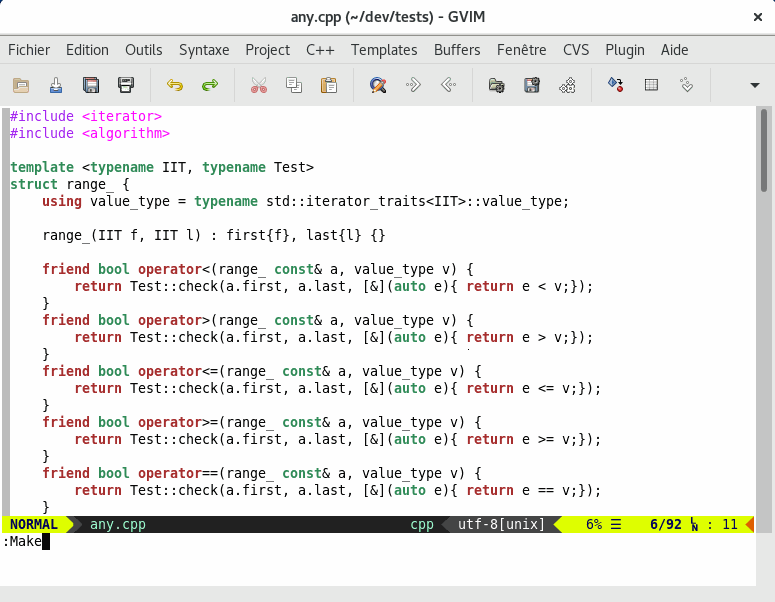

compil-hints
============

Add _ballons_ and _signs_ to show where compilation errors have occured.
The information is extracted from the [quickfix list](http://vimhelp.appspot.com/eval.txt.html#getqflist%28%29).


[](https://github.com/LucHermitte/vim-compil-hints/releases) [](https://www.openhub.net/p/21020)

## Features
 * Parses the quickfix list and presents its entries as
   [_signs_](http://vimhelp.appspot.com/sign.txt.html#signs) and/or
   [_balloons_](http://vimhelp.appspot.com/debugger.txt.html#balloon%2deval) --
   when supported by Vim.
 * Multiple issues happening on a same line are merged together, the highest
   error level is kept (_error_ > _warning_ > _note_ > _context_)
 * Balloons are automatically updated.
 * Signs are automatically updated at the end of a compilation, a (vim)grep...
   They are also automatically (and incrementally!) updated on asynchronous
   compilation/grepping -- that use
   [`:caddexpr`](http://vimhelp.appspot.com/quickfix.txt.html#%3acaddexpr),
   [`:grepadd`](http://vimhelp.appspot.com/quickfix.txt.html#%3agrepadd)...

   IOW, plugins that update the quickfix list don't need  to explicitly refresh
   the signs by calling `lh#compil_hints#update()` anymore since version 1.1.0.
 * Closing and opening the qf-window will activate and deactivate signs and
   balloons.
 * Signs and balloons are updated on
   [`:cnewer`](http://vimhelp.appspot.com/quickfix.txt.html#%3acnewer) & al.
 
## Commands

 * `:CompilHintsToggle` -- to start/stop using the plugin
 * `:CompilHintsUpdate` -- to update the signs to display

## Demo

TODO: Here is a little screencast to see how things are displayed with vim-compil-hints.



## Options

The
[options](https://github.com/LucHermitte/lh-vim-lib/blob/master/doc/Options.md) are:

#### `g:compil_hints.use_balloons`
Activates the display of balloons -- boolean: [1]/0

Requires Vim to be compiled with
[`+balloon_eval`](http://vimhelp.appspot.com/various.txt.html#%2bballoon_eval)
support.

#### `g:compil_hints.use_signs`
Activates the display of signs -- boolean: [1]/0

Requires Vim to be compiled with
[`+signs`](http://vimhelp.appspot.com/various.txt.html#%2bsigns) support.

#### `g:compil_hints.autostart`
When sets, the plugin is automatically started -- boolean: 1/[0]

Needs to be set in the `.vimrc`.

#### `(bpg):compil_hints.context_re`
Regular expression used to recognize and display differently messages like:

```
instantiated from
within this context
required from here
```

#### `(bpg):compil_hints.harsh_signs_removal_enabled`
Improves greatly the time required to remove signs. However, this options does
remove all signs in a buffer, even the one not placed by compil-hints.

boolean: 1/0; default: `! exists('*execute')` => false with recent versions of
Vim

#### `g:compil_hints.signs`
Permits to specify which codepoints to use as sign characters depending on the
level:

- `error`   , defaults to `["\u274c", 'XX']`            -- '&#x274c;', 'XX'
- `warning'`, defaults to `["\u26a0", "\u26DB", '!!']`  -- '&#x26a0;', '&#x26db;', '!!'
- `note'`   , defaults to `["\u2139", "\U1F6C8", 'ii']` -- '&#x2139;', '&#x1f6c8;', 'ii'
- `context'`, defaults to `['>>']`
- `info'`   , defaults to `["\u27a9", '->']`            -- '&#x27a9;', '->'

This feature is used only when:
- [`'guifont'`](http://vimhelp.appspot.com/options.txt.html#%27guifont%27) is
  available (i.e. in graphical sessions),
- and when gvim doesn't support
  [`+xpm`](http://vimhelp.appspot.com/various.txt.html#%2bxpm) -- Pixmal
  support has the precedence.
- and when the Python module `python-config` can be used.

Otherwise, the last value in each list will be used. IOW, if you know that the
font you use in your terminal always support `\u274c`, you can simply define in
your [`.vimrc`](http://vimhelp.appspot.com/starting.txt.html#%2evimrc) (only!).

```vim
" Manually
:let g:compil_hints             = get(g:, 'compil_hints', {'signs': {}})
:let g:compil_hints.signs       = get(g:compil_hints, 'signs', {})
:let g:compil_hints.signs.error = ["\u274c"] " ❌


" Or, thanks to lh-vim-lib
runtime plugin/let.vim
:LetTo g:compil_hints.signs.error = ["\u274c"] " ❌
```

Needs to be set in the `.vimrc`.

#### `g:compil_hints.hl`
Permits to specify which
[highlight](http://vimhelp.appspot.com/syntax.txt.html#%3ahighlight) group to
use depending on the level:

- `error`   , defaults to `error`
- `warning'`, defaults to `todo`
- `note'`   , defaults to `comment`
- `context'`, defaults to `constant`
- `info'`   , defaults to `todo`

Needs to be set in the `.vimrc`.

## Requirements / Installation

  * Requirements: Vim 7.+,
    [`+balloon_eval`](http://vimhelp.appspot.com/various.txt.html#%2bballoon_eval),
    [`+signs`](http://vimhelp.appspot.com/various.txt.html#%2bsigns),
    [lh-vim-lib](http://github.com/LucHermitte/lh-vim-lib) 4.5.0.

  * With [vim-addon-manager](https://github.com/MarcWeber/vim-addon-manager), install vim-compil-hints.

    ```vim
    ActivateAddons vim-compil-hints
    ```

  * or with [vim-flavor](http://github.com/kana/vim-flavor) which also supports
    dependencies:

    ```
    flavor 'LucHermitte/vim-compil-hints'
    ```

  * or with Vundle/NeoBundle (expecting I haven't forgotten anything):

    ```vim
    Bundle 'LucHermitte/lh-vim-lib'
    Bundle 'LucHermitte/vim-compil-hints'
    ```

## TO DO
- Handle local options for balloon use: use/restore `b:bexpr`
- When the quickfix list changes (background compilation with
  [BuildToolsWrapper](https://github.com/LucHermitte/vim-build-tools-wrapper/)), the balloons
  stop displaying anything.
- Ask fontconfig `fc-list`, when recent enough, which UTF-8 codepoints could be used.
- Check the behaviour with encodings other than UTF-8.
- Distinguish the two states _activated_ and _hidden_

## History
* V 1.1.0.
    * Automatically activate the signs and ballons on quickfix related commands.
    * Improve style options
* V 1.0.1.
    * Detect when XPM icons cannot be used.
    * Use the first UTF-8 glyphs
* V 1.0.0.
    * The XPM icons used come from Vim source code, they're under
      [Vim License](doc/uganda.txt).
    * Options have been renamed from `compil_hint_xxx` to `compil_hints.xxx`

* V 0.2.x.
    * This plugin is strongly inspired by syntastic, but it restricts its work to
    the result of the compilation.

## Notes
NB: it doesn't copy qflist() but always fetch the last version in order to
automagically rely on vim to update the line numbers.
